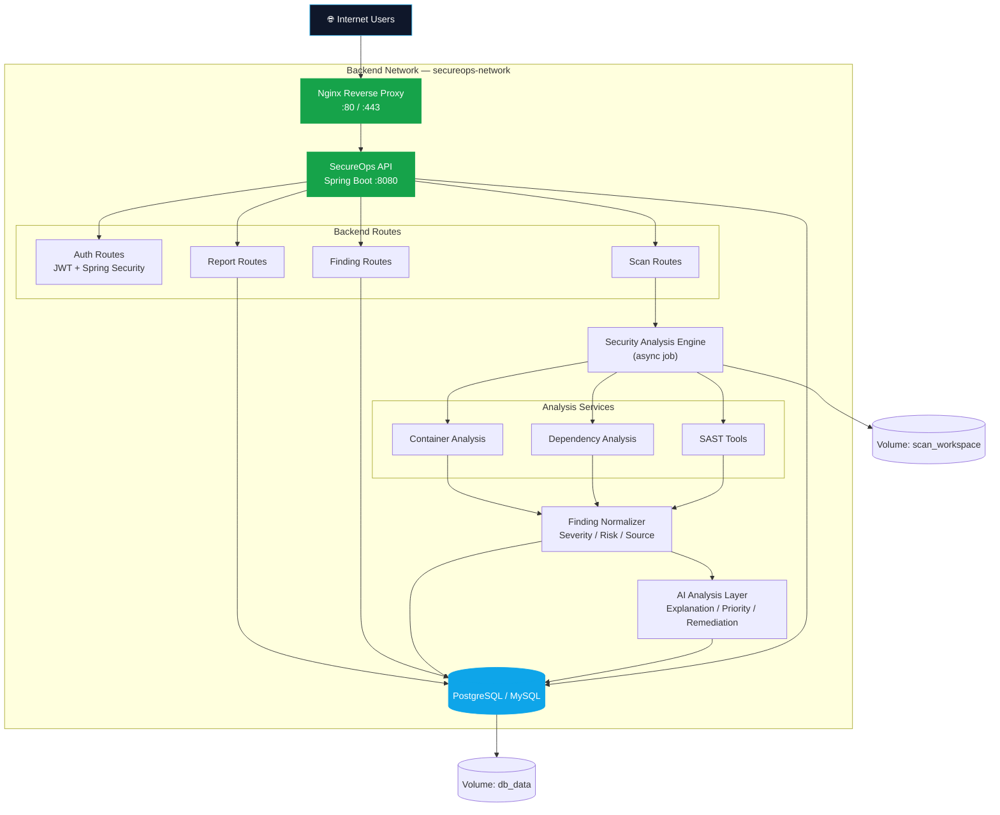
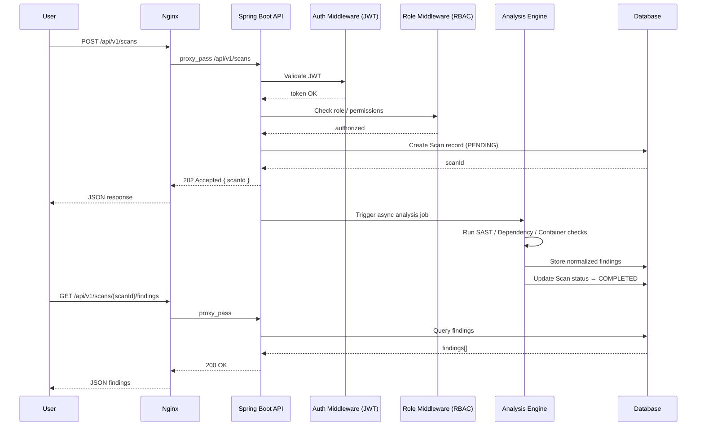
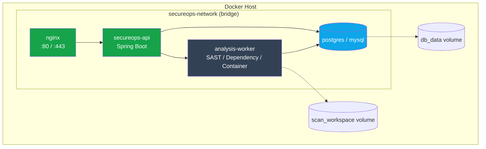

# SecureOps AI

### AI-Assisted Security Assessment Platform for Java/Spring Boot Applications

> **Status:** Ongoing — Architecture & Backend Foundation

SecureOps AI is a Java-based DevSecOps platform designed to identify security vulnerabilities in **Java/Spring Boot applications** and provide actionable security insights.

The project focuses on building a production-oriented **Spring Boot backend** that can orchestrate security analysis, process vulnerability findings, and eventually use AI to explain and prioritize identified issues.

---

## 1. Problem Statement

Security analysis is often performed manually or through multiple independent tools, making it difficult for developers to understand:

* Which vulnerabilities are critical
* Where they exist in the application
* What caused them
* How they should be fixed
* Which issues should be addressed first

SecureOps aims to provide a centralized backend workflow for analyzing Java applications and converting security findings into actionable information.

---

## 2. Project Goals

### Primary Goal

Build a platform that can automatically identify security vulnerabilities in Java/Spring Boot applications.

### Initial Scope

* Analyze Java/Spring Boot applications
* Detect common security vulnerabilities
* Collect and normalize security findings
* Assign severity and risk information
* Expose findings through REST APIs
* Containerize the platform using Docker
* Establish a foundation for CI/CD integration
* Add AI-assisted vulnerability explanation and prioritization

---

## 3. System Architecture



**Network:** all backend services communicate over a shared bridge network (`secureops-network`), with named volumes for `db_data` and `scan_workspace` (temporary checked-out repos / scan artifacts) persisting across container restarts.

> Components in the Analysis Services and AI Analysis Layer are part of the planned roadmap (Phase 3 / Phase 5), not completed functionality yet. The diagram reflects the target production topology.

### Request Lifecycle — Submit Scan



---

## 4. Backend Architecture

The core platform will be implemented using **Java and Spring Boot**.

```text
secureops/
│
├── src/main/java/com/secureops/
│   │
│   ├── controller/
│   │   ├── ScanController.java
│   │   ├── FindingController.java
│   │   └── ReportController.java
│   │
│   ├── service/
│   │   ├── ScanService.java
│   │   ├── SecurityAnalysisService.java
│   │   ├── FindingService.java
│   │   └── ReportService.java
│   │
│   ├── repository/
│   │   ├── ScanRepository.java
│   │   └── FindingRepository.java
│   │
│   ├── model/
│   │   ├── Scan.java
│   │   ├── Finding.java
│   │   └── Report.java
│   │
│   ├── dto/
│   │   ├── ScanRequest.java
│   │   ├── ScanResponse.java
│   │   └── FindingResponse.java
│   │
│   ├── security/
│   │   └── SecurityConfig.java
│   │
│   └── SecureOpsApplication.java
│
├── src/main/resources/
│   └── application.yml
│
├── Dockerfile
├── docker-compose.yml
├── pom.xml
└── README.md
```

The architecture follows a standard layered Spring Boot structure:

```text
Controller
    ↓
Service
    ↓
Repository
    ↓
Database
```

Security-analysis components will be separated from the API layer so that additional security tools can be integrated without tightly coupling them to the REST controllers.

---

## 5. Core Workflow

### Step 1 — Submit Application

A user submits a Java/Spring Boot application or repository for analysis.

```http
POST /api/v1/scans
```

Example:

```json
{
  "projectName": "sample-spring-app",
  "repositoryUrl": "repository-url"
}
```

### Step 2 — Create Scan

SecureOps creates a scan record and assigns it a unique scan ID.

```text
Scan
 ├── ID
 ├── Project
 ├── Status
 ├── CreatedAt
 └── CompletedAt
```

### Step 3 — Security Analysis

The analysis engine executes the configured security checks against the application.

Initially, the focus will be on **Java/Spring Boot security analysis**.

### Step 4 — Normalize Findings

Different security tools can produce different output formats.

SecureOps will normalize them into a common finding model.

```text
Finding
 ├── Title
 ├── Description
 ├── Severity
 ├── Category
 ├── Source
 ├── File
 ├── Line
 └── Remediation
```

### Step 5 — AI Analysis

The AI layer will consume normalized findings and provide:

* Vulnerability explanation
* Risk interpretation
* Suggested remediation
* Finding prioritization

### Step 6 — Report

The final results will be available through REST APIs and eventually through a report/dashboard layer.

---

## 6. Initial REST API Design

### Scan API

```http
POST   /api/v1/scans
GET    /api/v1/scans
GET    /api/v1/scans/{scanId}
```

### Findings API

```http
GET    /api/v1/scans/{scanId}/findings
GET    /api/v1/findings/{findingId}
```

### Reports API

```http
GET    /api/v1/scans/{scanId}/report
```

The API design will evolve as the backend implementation progresses.

---

## 7. Security Analysis

The security engine is planned to support multiple analysis categories.

### Source Code Analysis

Identify vulnerabilities in application source code.

Potential focus areas:

* Injection vulnerabilities
* Insecure API usage
* Authentication/authorization issues
* Hardcoded secrets
* Unsafe coding patterns

### Dependency Analysis

Analyze project dependencies for known vulnerabilities.

For Maven-based Spring Boot applications:

```text
pom.xml
   ↓
Dependency Analysis
   ↓
Known Vulnerabilities
   ↓
Normalized Findings
```

### Container Analysis

The platform will eventually analyze Docker images associated with the application.

```text
Spring Boot Application
        ↓
     Docker Build
        ↓
    Docker Image
        ↓
 Security Analysis
        ↓
 Vulnerability Findings
```

---

## 8. Docker Architecture

SecureOps itself will be containerized to provide a reproducible development and deployment environment.



Docker Compose will initially be used for local development and service orchestration, mirroring this topology (`nginx`, `secureops-api`, `analysis-worker`, `db`, plus named volumes) before migrating to Kubernetes in Phase 7.

---

## 9. Planned DevOps Workflow

The project will gradually introduce CI/CD automation.

```text
Developer
    │
    ▼
Git Push
    │
    ▼
GitHub
    │
    ▼
CI Pipeline
    │
    ├── Build
    ├── Test
    ├── Code Quality
    ├── Security Scan
    └── Docker Build
            │
            ▼
       Docker Image
            │
            ▼
       Deployment
```

Planned DevOps technologies include:

* GitHub
* Docker
* Docker Compose
* Jenkins / GitHub Actions
* Kubernetes
* Security scanning tools
* Container registry

---

## 10. Technology Stack

### Backend

* Java
* Spring Boot
* Spring Security
* Spring Data JPA
* REST APIs
* Maven

### Database

* MySQL / PostgreSQL

### Security

* SAST
* Dependency vulnerability scanning
* Container scanning
* Secret detection

### DevOps

* Git
* GitHub
* Docker
* Docker Compose
* Jenkins
* Kubernetes

### AI

* LLM-based vulnerability explanation
* Risk prioritization
* Remediation assistance

---

## 11. Development Roadmap

### Phase 1 — Foundation

* [x] Define project scope
* [x] Create README
* [x] Define initial architecture
* [x] Define technology stack
* [ ] Initialize Spring Boot project
* [ ] Configure Maven
* [ ] Create package structure

### Phase 2 — Backend Core

* [ ] Design database schema
* [ ] Implement Scan entity
* [ ] Implement Finding entity
* [ ] Implement REST APIs
* [ ] Add validation
* [ ] Add global exception handling
* [ ] Add API documentation

### Phase 3 — Security Engine

* [ ] Integrate source-code analysis
* [ ] Integrate dependency analysis
* [ ] Normalize security findings
* [ ] Implement severity classification
* [ ] Store scan results

### Phase 4 — Docker

* [ ] Create SecureOps Dockerfile
* [ ] Create Docker Compose setup
* [ ] Containerize analysis components
* [ ] Test isolated scan execution

### Phase 5 — AI Layer

* [ ] Integrate LLM
* [ ] Generate vulnerability explanations
* [ ] Generate remediation suggestions
* [ ] Implement risk prioritization

### Phase 6 — CI/CD & DevSecOps

* [ ] Create CI pipeline
* [ ] Automate security scans
* [ ] Build Docker images
* [ ] Push images to registry
* [ ] Deploy SecureOps

### Phase 7 — Kubernetes

* [ ] Create Kubernetes manifests
* [ ] Configure Services
* [ ] Configure Secrets
* [ ] Configure persistent storage
* [ ] Deploy SecureOps on Kubernetes

---

## 12. Current Status

**Current phase: Phase 1 — Foundation**

The project has currently been scoped around analyzing **Java/Spring Boot applications**, with **Java/Spring Boot as the core backend technology** and Docker as the initial deployment target.

The next implementation milestone is to build the Spring Boot backend and establish the scan → analysis → finding workflow before adding AI and advanced DevSecOps automation.

---

## 13. Long-Term Vision

SecureOps AI is intended to evolve from a security-analysis backend into a complete DevSecOps platform where a developer can submit an application and receive a centralized security assessment containing:

```text
Application
     ↓
Automated Security Analysis
     ↓
Vulnerability Detection
     ↓
Risk Prioritization
     ↓
AI Explanation
     ↓
Remediation Guidance
     ↓
Secure Deployment
```

The long-term objective is to make security analysis an integrated part of the application development and deployment lifecycle rather than a separate manual activity.
