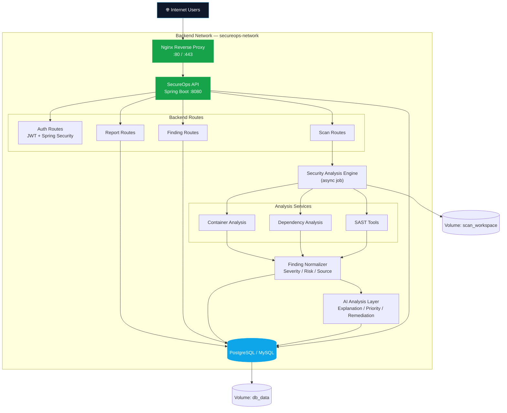
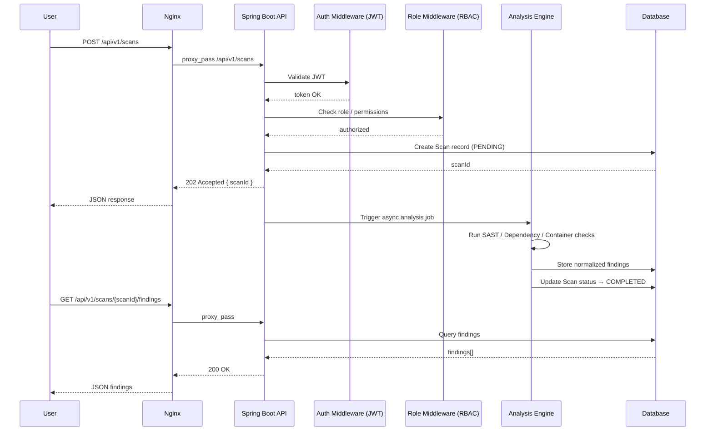
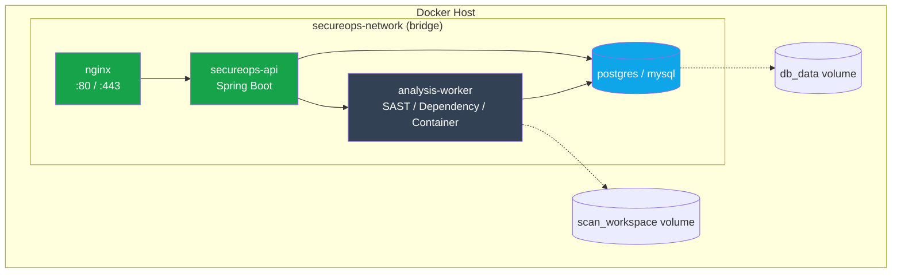

# SecureOps AI

### AI-Assisted Security Assessment Platform.

SecureOps AI is a Java-based DevSecOps platform designed to identify security vulnerabilities in ** applications** and provide actionable security insights.

The project focuses on building a production-oriented **Spring Boot backend** that can orchestrate security analysis, process vulnerability findings, and eventually use AI to explain and prioritize identified issues.

---

## 1. Problem Statement

Security analysis is often performed manually or through multiple independent tools, making it difficult for developers to understand:

* Which vulnerabilities are critical
* Where they exist in the application
* What caused them
* How they should be fixed
* Which issues should be addressed first

SecureOps aims to provide a centralized backend workflow for analyzing Java applications and converting security findings into actionable information.

---

## 2. Project Goals

### Primary Goal

Build a platform that can automatically identify security vulnerabilities in Java/Spring Boot applications.

### Initial Scope

* Analyze Java/Spring Boot applications
* Detect common security vulnerabilities
* Collect and normalize security findings
* Assign severity and risk information
* Expose findings through REST APIs
* Containerize the platform using Docker
* Establish a foundation for CI/CD integration
* Add AI-assisted vulnerability explanation and prioritization

---

## 3. System Architecture


```mermaid
flowchart TD
    U["🌐 Internet Users"] --> NGINX["Nginx Reverse Proxy<br/>:80 / :443"]

    subgraph NET["Backend Network — secureops-network"]
        NGINX --> API["SecureOps API<br/>Spring Boot :8080"]

        subgraph ROUTES["Backend Routes"]
            AUTH["Auth Routes<br/>JWT + Spring Security"]
            SCAN["Scan Routes"]
            FIND["Finding Routes"]
            REPORT["Report Routes"]
        end

        API --> AUTH
        API --> SCAN
        API --> FIND
        API --> REPORT

        SCAN --> ENGINE["Security Analysis Engine<br/>(async job)"]

        subgraph ANALYSIS["Analysis Services"]
            SAST["SAST Tools"]
            DEP["Dependency Analysis"]
            CONT["Container Analysis"]
        end

        ENGINE --> SAST
        ENGINE --> DEP
        ENGINE --> CONT

        SAST --> NORM["Finding Normalizer<br/>Severity / Risk / Source"]
        DEP --> NORM
        CONT --> NORM

        NORM --> AILAYER["AI Analysis Layer<br/>Explanation / Priority / Remediation"]

        API --> DB[("PostgreSQL / MySQL")]
        AILAYER --> DB
        NORM --> DB
        FIND --> DB
        REPORT --> DB
    end

    DB --> VOL1[("Volume: db_data")]
    ENGINE --> VOL2[("Volume: scan_workspace")]

    style U fill:#0f172a,color:#fff,stroke:#38bdf8
    style NGINX fill:#16a34a,color:#fff,stroke:#16a34a
    style API fill:#16a34a,color:#fff,stroke:#16a34a
    style DB fill:#0ea5e9,color:#fff,stroke:#0ea5e9
```

**Network:** all backend services communicate over a shared bridge network (`secureops-network`), with named volumes for `db_data` and `scan_workspace` (temporary checked-out repos / scan artifacts) persisting across container restarts.

> Components in the Analysis Services and AI Analysis Layer are part of the planned roadmap (Phase 3 / Phase 5), not completed functionality yet. The diagram reflects the target production topology.

### Request Lifecycle — Submit Scan


```mermaid
sequenceDiagram
    participant User
    participant Nginx
    participant API as Spring Boot API
    participant Auth as Auth Middleware (JWT)
    participant RBAC as Role Middleware (RBAC)
    participant Engine as Analysis Engine
    participant DB as Database

    User->>Nginx: POST /api/v1/scans
    Nginx->>API: proxy_pass /api/v1/scans
    API->>Auth: Validate JWT
    Auth-->>API: token OK
    API->>RBAC: Check role / permissions
    RBAC-->>API: authorized
    API->>DB: Create Scan record (PENDING)
    DB-->>API: scanId
    API-->>Nginx: 202 Accepted { scanId }
    Nginx-->>User: JSON response

    API->>Engine: Trigger async analysis job
    Engine->>Engine: Run SAST / Dependency / Container checks
    Engine->>DB: Store normalized findings
    Engine->>DB: Update Scan status → COMPLETED

    User->>Nginx: GET /api/v1/scans/{scanId}/findings
    Nginx->>API: proxy_pass
    API->>DB: Query findings
    DB-->>API: findings[]
    API-->>Nginx: 200 OK
    Nginx-->>User: JSON findings
```

---


## 5. Core Workflow

### Step 1 — Submit Application

A user submits a Java/Spring Boot application or repository for analysis.

```http
POST /api/v1/scans
```

Example:

```json
{
  "projectName": "sample-spring-app",
  "repositoryUrl": "repository-url"
}
```

### Step 2 — Create Scan

SecureOps creates a scan record and assigns it a unique scan ID.

```text
Scan
 ├── ID
 ├── Project
 ├── Status
 ├── CreatedAt
 └── CompletedAt
```

### Step 3 — Security Analysis

The analysis engine executes the configured security checks against the application.

Initially, the focus will be on **Java/Spring Boot security analysis**.

### Step 4 — Normalize Findings

Different security tools can produce different output formats.

SecureOps will normalize them into a common finding model.

```text
Finding
 ├── Title
 ├── Description
 ├── Severity
 ├── Category
 ├── Source
 ├── File
 ├── Line
 └── Remediation
```

### Step 5 — AI Analysis

The AI layer will consume normalized findings and provide:

* Vulnerability explanation
* Risk interpretation
* Suggested remediation
* Finding prioritization

### Step 6 — Report

The final results will be available through REST APIs and eventually through a report/dashboard layer.

---

## 6. Initial REST API Design

### Scan API

```http
POST   /api/v1/scans
GET    /api/v1/scans
GET    /api/v1/scans/{scanId}
```

### Findings API

```http
GET    /api/v1/scans/{scanId}/findings
GET    /api/v1/findings/{findingId}
```

### Reports API

```http
GET    /api/v1/scans/{scanId}/report
```

The API design will evolve as the backend implementation progresses.

---

## 7. Security Analysis

The security engine is planned to support multiple analysis categories.

### Source Code Analysis

Identify vulnerabilities in application source code.

Potential focus areas:

* Injection vulnerabilities
* Insecure API usage
* Authentication/authorization issues
* Hardcoded secrets
* Unsafe coding patterns

### Dependency Analysis

Analyze project dependencies for known vulnerabilities.

For Maven-based Spring Boot applications:

```text
pom.xml
   ↓
Dependency Analysis
   ↓
Known Vulnerabilities
   ↓
Normalized Findings
```

### Container Analysis

The platform will eventually analyze Docker images associated with the application.

```text
Spring Boot Application
        ↓
     Docker Build
        ↓
    Docker Image
        ↓
 Security Analysis
        ↓
 Vulnerability Findings
```

---

## 8. Docker Architecture

SecureOps itself will be containerized to provide a reproducible development and deployment environment.


```mermaid
flowchart TD
    subgraph HOST["Docker Host"]
        NGINX["nginx<br/>:80 / :443"]

        subgraph NET["secureops-network (bridge)"]
            NGINX --> API["secureops-api<br/>Spring Boot"]
            API --> WORKER["analysis-worker<br/>SAST / Dependency / Container"]
            API --> DB[("postgres / mysql")]
            WORKER --> DB
        end

        DB -.-> V1[("db_data volume")]
        WORKER -.-> V2[("scan_workspace volume")]
    end

    style NGINX fill:#16a34a,color:#fff
    style API fill:#16a34a,color:#fff
    style WORKER fill:#334155,color:#fff
    style DB fill:#0ea5e9,color:#fff
```

Docker Compose will initially be used for local development and service orchestration, mirroring this topology (`nginx`, `secureops-api`, `analysis-worker`, `db`, plus named volumes) before migrating to Kubernetes in Phase 7.


## 10. Technology Stack

### Backend

* Java 21
* Spring Boot 4.1.1
* Spring Security
* Spring Data JPA
* REST APIs
* Maven
* Jackson (JSON parsing)
* Lombok

### Database

* PostgreSQL 18+

### Security

* Trivy (CVE/Container analysis) - Phase 6 integrated
* Future: Semgrep (SAST), OWASP Dependency Check
* Secret detection
* Container scanning

### DevOps

* Git
* GitHub
* Docker
* Docker Compose
* Maven
* Tomcat (embedded)

### AI

* LLM-based vulnerability explanation (planned)
* Risk prioritization (planned)
* Remediation assistance (planned)

---

## 11. Development Roadmap

### Phase 0 — Foundation (✅ Complete)
* [x] Spring Boot 4.1.1 project with Java 21
* [x] PostgreSQL connectivity with HikariCP
* [x] Health check endpoint (`GET /api/health`)
* [x] Database auto-initialization (ddl-auto=update)

### Phase 1 — Project Management (✅ Complete)
* [x] Project entity with UUID primary key
* [x] ProjectRepository (Spring Data JPA)
* [x] ProjectService (CRUD operations)
* [x] ProjectController (3 endpoints: POST, GET all, GET by ID)
* [x] Duplicate project prevention (unique constraint on name)
* [x] Global exception handling

### Phase 2 — Pipeline Management (✅ Complete)
* [x] Pipeline entity with foreign key to Project
* [x] PipelineProvider enum (JENKINS, GITHUB_ACTIONS, etc.)
* [x] PipelineService with project validation
* [x] PipelineController (3 endpoints)
* [x] Duplicate pipeline prevention (composite unique constraint)

### Phase 3 — Scan Management (✅ Complete)
* [x] Scan entity with dual FKs (Project, Pipeline)
* [x] Environment enum (DEVELOPMENT, STAGING, PRODUCTION)
* [x] ScanStatus enum (CREATED, PROCESSING, COMPLETED, FAILED)
* [x] Three-step cross-project security validation
* [x] Unique constraint allowing multiple scans per pipeline in different environments

### Phase 4 — Report Ingestion (✅ Complete)
* [x] Report entity with FK to Scan
* [x] ReportTool enum (TRIVY, SEMGREP, OWASP_DEPENDENCY_CHECK)
* [x] ReportStatus enum (RECEIVED, PROCESSING, PROCESSED, FAILED)
* [x] Multipart file upload to `/api/scans/{scanId}/reports?tool=TRIVY`
* [x] Filesystem storage strategy (./reports/{scanId}/{tool}/{timestamp}_{filename})
* [x] Unique constraint (one report per tool per scan)

### Phase 5 — Finding Domain (✅ Complete)
* [x] Finding entity with dual FKs (Scan, Report)
* [x] Severity enum (CRITICAL, HIGH, MEDIUM, LOW)
* [x] FindingStatus enum (OPEN, RESOLVED)
* [x] FingerprintService with deterministic SHA-256 hashing
* [x] FindingService (CRUD + cross-project validation)
* [x] FindingController (GET/POST endpoints)
* [x] APIs: GET findings by scan, GET specific finding, POST create finding

### Phase 6 — Trivy Report Parsing (✅ Complete)
* [x] SecurityReportParser interface for pluggable parsers
* [x] TrivyParser implementation with field mapping
* [x] Jackson POJOs (TrivyReport, TrivyResult, TrivyVulnerability)
* [x] ReportProcessingService orchestrating parsing and persistence
* [x] API: `POST /api/scans/{scanId}/reports/{reportId}/process`
* [x] Edge case handling (missing fields, unknown severity, malformed JSON)
* [x] Sample Trivy JSON with multiple targets and vulnerabilities
* [x] Report status tracking (RECEIVED → PROCESSING → PROCESSED)

### Phase 7 — Deterministic Risk Engine (✅ Complete)
* [x] RiskScore DTO with findings count by severity
* [x] RiskEngine service with weighted scoring
* [x] Severity weights (CRITICAL=10, HIGH=7, MEDIUM=4, LOW=1)
* [x] RiskController with GET `/api/scans/{scanId}/risk` endpoint
* [x] Deterministic and reproducible calculation
* [x] Comprehensive logging and error handling

### Phase 8 — Configurable Security Policy System (✅ Complete)
* [x] Policy entity with project + environment + thresholds
* [x] PolicyEnvironment enum (DEVELOPMENT, STAGING, PRODUCTION)
* [x] PolicyRepository with custom queries
* [x] PolicyService with CRUD operations + validation
* [x] PolicyController with REST endpoints (POST, GET, PUT)
* [x] PolicyEngine for policy evaluation
* [x] Project-level isolation (different projects, different policies)
* [x] Database-driven policies (not hardcoded)
* [x] Validation for negative thresholds and missing projects

### Phase 9 — SecurityDecision & Policy Enforcement (Planned)
* [ ] OWASPDependencyCheckParser for dependency analysis
* [ ] XML report parsing
* [ ] Package vulnerability matching

### Phase 9 — Finding Deduplication (Planned)
* [ ] Cross-scan fingerprint matching
* [ ] Vulnerability lifecycle tracking (NEW, PERSISTENT, RESOLVED, REGRESSED)
* [ ] Finding correlation across multiple scans

### Phase 10 — Risk & Policy (Planned)
* [ ] Risk scoring (CVSS integration)
* [ ] SLA-based remediation policies
* [ ] Auto-resolution based on policy

### Phase 11 — AI Layer (Planned)
* [ ] LLM integration for vulnerability explanation
* [ ] Risk prioritization
* [ ] Remediation suggestions

### Phase 12 — Kubernetes Deployment (Planned)
* [ ] Kubernetes manifests
* [ ] Service and ingress configuration
* [ ] Persistent storage configuration
* [ ] Helm charts

---

## 12. Current Status

**Current phase: Phase 8 — Configurable Security Policy System (Complete)**

Completed phases:
- Phase 0: Spring Boot health checks and database connectivity
- Phase 1: Project management with multi-tenancy
- Phase 2: Pipeline management per project
- Phase 3: Scan management with cross-project isolation
- Phase 4: Report ingestion with filesystem storage
- Phase 5: Finding domain with deterministic fingerprinting
- Phase 6: Real Trivy JSON parsing with edge case handling
- Phase 7: Deterministic risk scoring by severity
- Phase 8: Configurable environment-specific security policies

**Current Functionality**:
```
Report Upload (Phase 4)
    ↓
Trivy JSON Parsing (Phase 6)
    ↓
Normalized Findings (Phase 5)
    ↓
Risk Scoring (Phase 7)
    ↓
Policy Evaluation (Phase 8) ← NEW
    ↓
REST APIs
```

**Data Flow**:
1. User uploads Trivy JSON report → stored in filesystem
2. System parses JSON → converts CVEs to normalized findings
3. Risk engine calculates weighted score from finding severities
4. Policy engine evaluates scan against project's configurable policy
5. Different projects can have different policies for same environment
6. All findings, scores, and policies queryable via REST APIs

All findings extracted from security tools are now persisted, scored by risk, evaluated against policies, and ready for policy-based decision making.

---

## 13. API Endpoints Overview

### Health Check
```
GET /api/health
→ {"status":"UP","service":"SecureOps","database":"UP"}
```

### Projects (Phase 1)
```
POST   /api/projects                    - Create project
GET    /api/projects                    - List all projects
GET    /api/projects/{projectId}        - Get project by ID
```

### Pipelines (Phase 2)
```
POST   /api/pipelines                   - Create pipeline
GET    /api/pipelines                   - List all pipelines
GET    /api/pipelines/{pipelineId}      - Get pipeline by ID
```

### Scans (Phase 3)
```
POST   /api/projects/{projectId}/scans  - Create scan
GET    /api/projects/{projectId}/scans  - List scans for project
GET    /api/scans/{scanId}              - Get scan by ID
```

### Reports (Phase 4)
```
POST   /api/scans/{scanId}/reports?tool=TRIVY              - Upload report
GET    /api/scans/{scanId}/reports                         - List reports for scan
GET    /api/reports/{reportId}                             - Get report by ID
POST   /api/scans/{scanId}/reports/{reportId}/process      - Parse report (Phase 6)
```

### Findings (Phase 5 & 6)
```
GET    /api/scans/{scanId}/findings                        - List findings for scan
GET    /api/findings/{findingId}                           - Get finding by ID
POST   /api/scans/{scanId}/findings?reportId={reportId}   - Create finding (test)
```

### Risk Scoring (Phase 7)
```
GET    /api/scans/{scanId}/risk                           - Calculate risk score for scan
→ {"scanId":"...", "riskScore":38, "criticalCount":1, "highCount":2, "mediumCount":2, "lowCount":0}
```

### Security Policies (Phase 8)
```
POST   /api/projects/{projectId}/policies                                   - Create policy
GET    /api/projects/{projectId}/policies                                   - List policies for project
GET    /api/projects/{projectId}/policies/{environment}                    - Get specific policy
PUT    /api/projects/{projectId}/policies/{environment}                    - Update policy
→ Each project can define different thresholds for different environments
```

---

## 14. Long-Term Vision

SecureOps AI is intended to evolve from a security-analysis backend into a complete DevSecOps platform where a developer can submit an application and receive a centralized security assessment containing:

```text
Application
     ↓
Automated Security Analysis
     ↓
Vulnerability Detection
     ↓
Risk Prioritization
     ↓
AI Explanation
     ↓
Remediation Guidance
     ↓
Secure Deployment
```

The long-term objective is to make security analysis an integrated part of the application development and deployment lifecycle rather than a separate manual activity.
